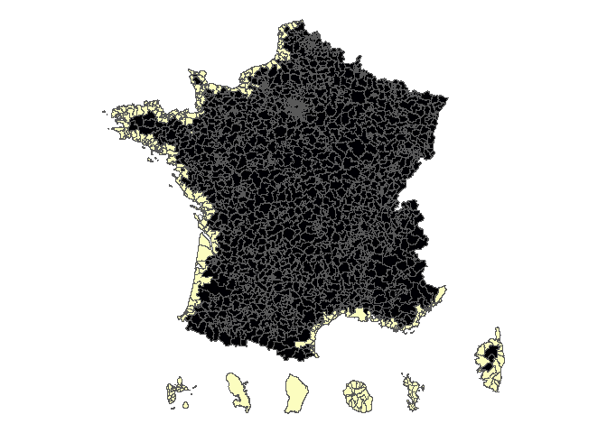

# Analyse de l’emploi et du marché du travail maritime - version 2019

## Constitution des familles de métiers/secteurs

  - Métiers : à partir des appellations ROME, une liste de 936
    appellations reliée à l’emploi maritime a été constituée et ventilée
    en 10 familles.

  - Secteurs : 54 NAF ont été selectionnés et ventilés selon les 10
    mêmes familles.

Ces nomenclatures sont identiques à celles utilisées dans l’étude 2019,
sur 2018.

## Zones littorales

A partir d’une nomenclature des cantons-villes de l’Insee, une liste des
zones “littorales” a été constituée, puis validée au niveau régional.

<!-- -->

Selon les sources de données, certaines familles sont filtrées afin de
ne les prendre en compte que pour les zones littorales.

## Sources de données

Sont mobilisées :

<table>

<thead>

<tr>

<th style="text-align:left;">

source

</th>

<th style="text-align:left;">

remarque

</th>

<th style="text-align:left;">

temporalite

</th>

<th style="text-align:left;">

selection

</th>

</tr>

</thead>

<tbody>

<tr>

<td style="text-align:left;">

Emploi salarié Acoss

</td>

<td style="text-align:left;">

hors Mayotte où la population-mère BMO prend le relai + hors Défense et
administation maritimes + de fait hors MSA, ce qui sous-estime Pêche et
cultures marines

</td>

<td style="text-align:left;">

2019

</td>

<td style="text-align:left;">

NAF

</td>

</tr>

<tr>

<td style="text-align:left;">

Offres collectées

</td>

<td style="text-align:left;">

</td>

<td style="text-align:left;">

2019

</td>

<td style="text-align:left;">

ROME

</td>

</tr>

<tr>

<td style="text-align:left;">

Compétences offres

</td>

<td style="text-align:left;">

</td>

<td style="text-align:left;">

2019

</td>

<td style="text-align:left;">

ROME

</td>

</tr>

<tr>

<td style="text-align:left;">

Embauches - DPAE

</td>

<td style="text-align:left;">

</td>

<td style="text-align:left;">

2019

</td>

<td style="text-align:left;">

NAF

</td>

</tr>

<tr>

<td style="text-align:left;">

DEFM

</td>

<td style="text-align:left;">

En moyenne sur 12 mois

</td>

<td style="text-align:left;">

2019

</td>

<td style="text-align:left;">

ROME

</td>

</tr>

<tr>

<td style="text-align:left;">

Entrées en formation

</td>

<td style="text-align:left;">

</td>

<td style="text-align:left;">

Octobre 2018 - septembre 2019

</td>

<td style="text-align:left;">

Formacode

</td>

</tr>

</tbody>

</table>

En fonction des sources de données et des familles, des filtres peuvent
être effectués pour restreindre uniquement sur le littoral.

<table>

<thead>

<tr>

<th style="text-align:left;">

Famille

</th>

<th style="text-align:left;">

Emploi.Acoss

</th>

<th style="text-align:left;">

DPAE

</th>

<th style="text-align:left;">

Offres

</th>

<th style="text-align:left;">

Offres.compétences

</th>

<th style="text-align:left;">

DEFM

</th>

<th style="text-align:left;">

Formation

</th>

</tr>

</thead>

<tbody>

<tr>

<td style="text-align:left;">

Activités et loisirs littoraux

</td>

<td style="text-align:left;">

Littoral

</td>

<td style="text-align:left;">

Littoral

</td>

<td style="text-align:left;">

Littoral

</td>

<td style="text-align:left;">

Littoral

</td>

<td style="text-align:left;">

Littoral

</td>

<td style="text-align:left;">

X

</td>

</tr>

<tr>

<td style="text-align:left;">

Construction et maintenance navale

</td>

<td style="text-align:left;">

X

</td>

<td style="text-align:left;">

X

</td>

<td style="text-align:left;">

X

</td>

<td style="text-align:left;">

X

</td>

<td style="text-align:left;">

X

</td>

<td style="text-align:left;">

X

</td>

</tr>

<tr>

<td style="text-align:left;">

Défense et adminstrations maritimes

</td>

<td style="text-align:left;">

X

</td>

<td style="text-align:left;">

X

</td>

<td style="text-align:left;">

X

</td>

<td style="text-align:left;">

X

</td>

<td style="text-align:left;">

X

</td>

<td style="text-align:left;">

X

</td>

</tr>

<tr>

<td style="text-align:left;">

Hôtellerie-restauration

</td>

<td style="text-align:left;">

Littoral

</td>

<td style="text-align:left;">

Littoral

</td>

<td style="text-align:left;">

Littoral

</td>

<td style="text-align:left;">

Littoral

</td>

<td style="text-align:left;">

Littoral

</td>

<td style="text-align:left;">

X

</td>

</tr>

<tr>

<td style="text-align:left;">

Pêche et cultures marines

</td>

<td style="text-align:left;">

X

</td>

<td style="text-align:left;">

X

</td>

<td style="text-align:left;">

X

</td>

<td style="text-align:left;">

X

</td>

<td style="text-align:left;">

X

</td>

<td style="text-align:left;">

X

</td>

</tr>

<tr>

<td style="text-align:left;">

Personnel embarqué

</td>

<td style="text-align:left;">

X

</td>

<td style="text-align:left;">

X

</td>

<td style="text-align:left;">

X

</td>

<td style="text-align:left;">

X

</td>

<td style="text-align:left;">

X

</td>

<td style="text-align:left;">

X

</td>

</tr>

<tr>

<td style="text-align:left;">

R\&D et ingénierie maritime

</td>

<td style="text-align:left;">

X

</td>

<td style="text-align:left;">

X

</td>

<td style="text-align:left;">

X

</td>

<td style="text-align:left;">

X

</td>

<td style="text-align:left;">

X

</td>

<td style="text-align:left;">

X

</td>

</tr>

<tr>

<td style="text-align:left;">

Services portuaires et nautiques

</td>

<td style="text-align:left;">

X

</td>

<td style="text-align:left;">

X

</td>

<td style="text-align:left;">

X

</td>

<td style="text-align:left;">

X

</td>

<td style="text-align:left;">

X

</td>

<td style="text-align:left;">

X

</td>

</tr>

<tr>

<td style="text-align:left;">

Transformation des produits de la mer

</td>

<td style="text-align:left;">

X

</td>

<td style="text-align:left;">

X

</td>

<td style="text-align:left;">

X

</td>

<td style="text-align:left;">

X

</td>

<td style="text-align:left;">

X

</td>

<td style="text-align:left;">

X

</td>

</tr>

<tr>

<td style="text-align:left;">

Travaux en mer

</td>

<td style="text-align:left;">

Littoral

</td>

<td style="text-align:left;">

Littoral

</td>

<td style="text-align:left;">

Littoral

</td>

<td style="text-align:left;">

Littoral

</td>

<td style="text-align:left;">

X

</td>

<td style="text-align:left;">

X

</td>

</tr>

</tbody>

</table>
